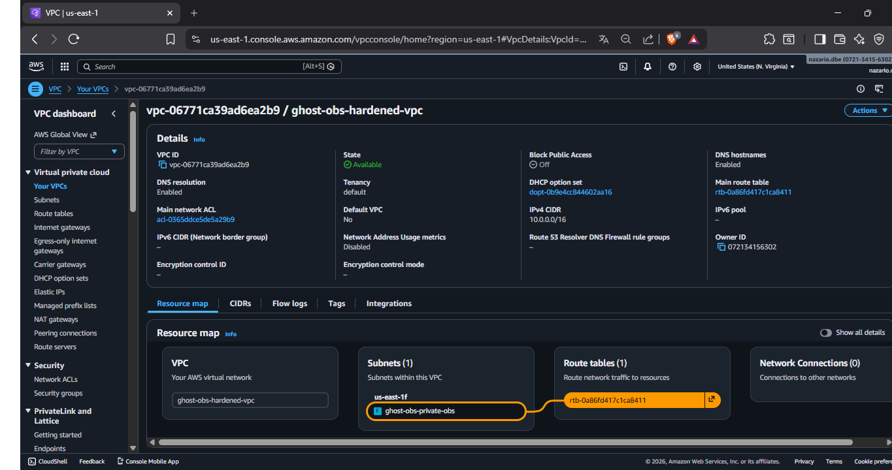
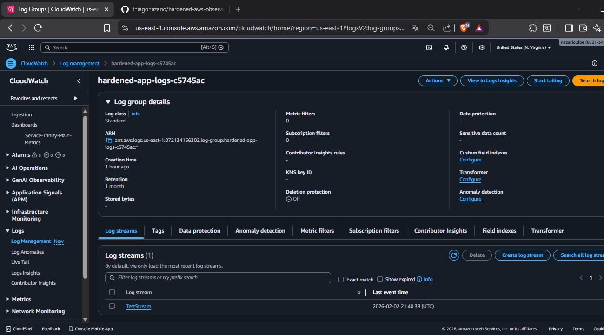

# AWS Hardened Observability Stack 🛡️📊

**Methodology:** Hardened by Design & DevSecOps Standards
**Engine:** Pulumi + Python (Infrastructure as Code)

This repository implements a production-ready AWS infrastructure focused on the **Service Trinity** (Logs, Metrics, Tracing) with a zero-trust networking approach.

## 🏗️ Architecture Blueprint
Deployed via Pulumi in under 30 seconds, this stack enforces:
- **Private-First VPC:** Isolated subnets without Internet Gateway (IGW) exposure.
- **FinOps-Centric Tracing:** AWS X-Ray sampling rules at 5% to balance visibility and cost.
- **Automated Observability:** Centralized CloudWatch Dashboards and Log Groups with 30-day retention.

## 🛡️ Hardened Implementation
- [x] **Network Isolation:** No public IP mapping for resources.
- [x] **Traceability:** Sampling rules labeled with `Standard: DevSecOps`.
- [x] **Identity & Access:** IAM policies scoped to the principle of least privilege.

## 📸 Technical Proof of Concept

| Hardened VPC Resource Map | Live Telemetry Validation |
|---|---|
|  |  |

## 🛠️ Operational Validation (The "Ping")
To verify the telemetry pipeline without deploying compute resources, run these commands via AWS CLI:

```bash
# 1. Create the log stream
aws logs create-log-stream --log-group-name hardened-app-logs-c5745ac --log-stream-name "TestStream" --region us-east-1

# 2. Send validation ping
aws logs put-log-events --log-group-name hardened-app-logs-c5745ac --log-stream-name "TestStream" --log-events timestamp=$(date +%s%3N),message="Ghost Architect: Hardened Stack Validation Ping" --region us-east-1
```

*Created by the Ghost Architect. Assets captured in English/Dark Mode for global standard compatibility.*